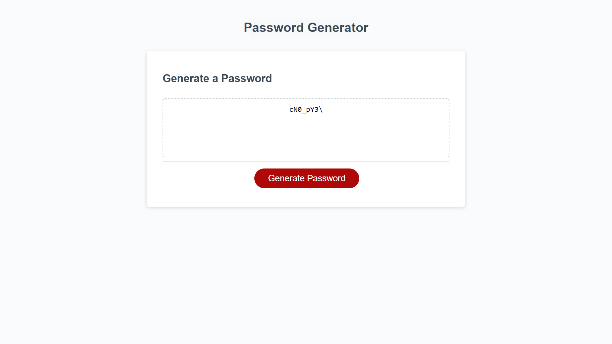

# key-vault-creator

A simple password generator application

## Description

Generate strong, custom passwords effortlessly with our intuitive Password Generator. Tailor your passwords to your security needs and create unique combinations, ensuring robust protection for your accounts and sensitive information.

## Installation

No installation needed

[Click here to see live copy of the site](https://lav3ll.github.io/key-vault-creator)

[Link to key vault creator repo](https://github.com/lav3ll/key-vault-creator/)

## Usage

**Website Overview:**
Welcome to our Key Vault Creator!(Password Generator) Customize your password by selecting a character length between 8 and 128, and pick from uppercase, lowercase, numbers, and special characters. Hit the 'Generate Password' button to create a unique and secure password tailored to your preferences

**Key Features:**
Secure password generation

**Goals and Results:**
Assist in providing the user with a random password made using their provided specifications.

## Credits

Skills For Life
Ed X

## License

MIT License
